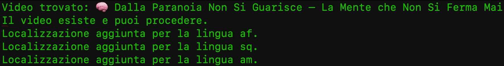
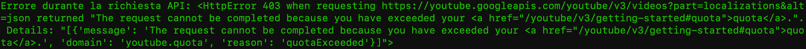

# 🎥 YouTube Video Localization Script

Questo script Python ti permette di tradurre e aggiungere localizzazioni per i titoli e le descrizioni dei video YouTube. Utilizza l'API di YouTube per interagire con i video, tradurre il contenuto e aggiornarlo in più lingue.

## 📝 Descrizione

Questo script è utile per chi desidera rendere i propri video YouTube più accessibili a un pubblico globale. Traduce automaticamente i titoli e le descrizioni dei video in lingue selezionate, aggiungendo la localizzazione direttamente tramite l'API di YouTube.

### Caratteristiche principali:
- Autenticazione con OAuth 2.0 tramite il client di Google.
- Traduzione automatica di titoli e descrizioni in lingue supportate.
- Aggiunta di localizzazioni per ciascuna lingua nel video.
- Funzionalità di verifica della localizzazione esistente per ogni lingua.
- Configurazione tramite file esterni per lingue e chiavi API.

---

## ⚙️ Requisiti

Prima di iniziare, assicurati di avere installato:

- Python 3.x
- Un account Google con accesso all'API di YouTube (attivata nel Google Cloud Console)

---

## 📦 Installazione

1. **Clona il repository:**
   Puoi clonare questo repository sulla tua macchina locale usando Git:
   ```bash
   git clone https://github.com/tuo-username/youtube-localization-script.git

2.	Installa le dipendenze:
    Una volta clonato il repository, naviga nella cartella del progetto e installa tutte le dipendenze necessarie:
     ```bash
        cd youtube-localization-script
        pip install -r requirements.txt

## 🚀 Configurazione
1.	**Crea un progetto Google Cloud:**
    •	Vai su Google Cloud Console.
    •	Crea un nuovo progetto e attiva l’API YouTube Data v3.
    •	Crea delle credenziali OAuth 2.0 (scarica il file client_secrets.json).
	
2.	**Configura il file delle lingue:**
	•	Crea un file chiamato youtube_languages.txt e aggiungi i codici delle lingue per cui desideri aggiungere la localizzazione (un codice lingua per riga). ( c'è già un file contentente tutte le lingue disponibili)
    
3.	**Scarica il file client_secrets.json e posizionalo nella stessa cartella dello script.**

## 🎬 Utilizzo

Per eseguire lo script, basta fornire l’ID del video di YouTube come argomento. L’ID del video è la parte che segue v= nell’URL del video (ad esempio, https://www.youtube.com/watch?v=cdVsEQsvTZg → cdVsEQsvTZg).

Esegui lo script con il comando:
```bash
python traduci.py <VIDEO_ID>
```



Dove <VIDEO_ID> è l’ID del video che desideri localizzare.
Lo script si autentica con Google, verifica l’esistenza del video, traduce il titolo e la descrizione nelle lingue selezionate e le aggiunge come localizzazioni. Puoi anche vedere un riepilogo delle lingue localizzate.

## 📋 Dettagli Funzionalità
1.	Autenticazione con Google API:
    Lo script utilizza OAuth 2.0 per autenticarsi e ottenere un token di accesso, che consente di interagire con l’API YouTube.
2.	Traduzione automatica:
    Lo script traduce automaticamente i titoli e le descrizioni dei video in più lingue utilizzando Google Translate.
3.	Aggiunta di Localizzazioni:
    Lo script aggiorna le localizzazioni nel video tramite l’API YouTube, permettendo di aggiungere il titolo e la descrizione tradotti per ogni lingua.
4.	Verifica della Localizzazione:
    Viene eseguita una verifica per assicurarsi che le lingue siano già localizzate prima di procedere con l’aggiunta.

⸻

## 🛠️ Tecnologie Utilizzate
	•	Python 3.x: Linguaggio di programmazione principale.
	•	Google API Client: Per interagire con l’API YouTube.
	•	Google Translate API: Per la traduzione automatica.
	•	OAuth 2.0: Per l’autenticazione e l’accesso alle API.

⸻

## 🔧 Risoluzione Problemi

1. Errore 403 - Forbidden

Questo errore si verifica se l’account Google non ha i permessi necessari. Assicurati di:
	•	Avere il permesso di modificare il video.
	•	Essere autenticato con un account che ha il controllo sul video.
	•	Verifica che l’API di YouTube sia abilitata nel Google Cloud Console.

2. Errore di traduzione

Se il servizio di traduzione non è disponibile o non può tradurre una lingua, assicurati che la lingua sia correttamente supportata da Google Translate e che il codice lingua sia valido.

4. Errore 403 - Quota Exeeded
   Si verifica quando si ha già utilizzato tutte le chiamate a noi disponibili in 24 ore.
   
5. Se si avesse già fatto una traduzione il programma non spreca le quote di API disponibili e salta alla prossima lingua
⸻

## 📄 Contributi

Se desideri contribuire al progetto, sentiti libero di aprire una pull request. Per segnalare bug o problemi, apri un issue.
1.	Fork del repository.
2.	Crea un ramo (git checkout -b feature-xyz).
3.	Apporta le modifiche necessarie.
4.	Committa le modifiche (git commit -am 'Aggiungi nuove funzionalità').
5.	Pusha sul ramo (git push origin feature-xyz).
6.	Crea una pull request.

## 📧 Contatti

Per qualsiasi domanda, sentiti libero di contattarmi tramite email a: mattioli.simone.10@gmail.com